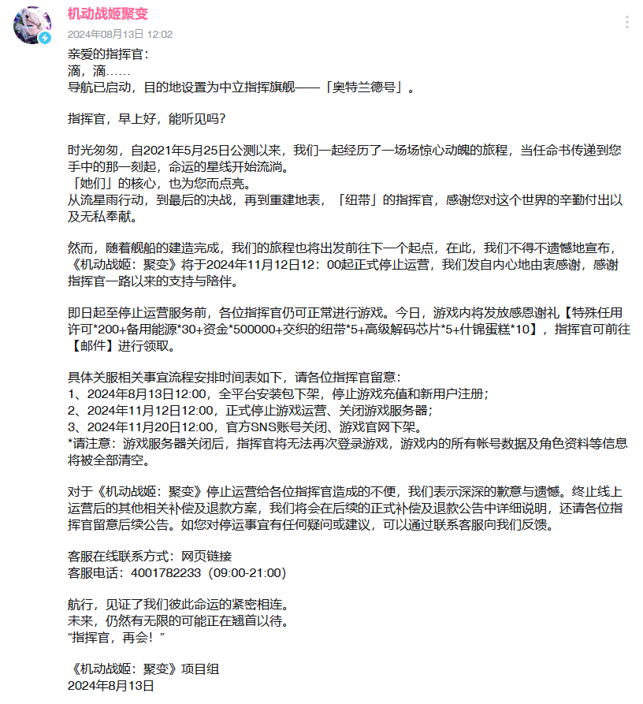

ArteryGear-Unpack
===
此库储存 机动战姬：聚变 ArteryGear CN  归档

### 第一版数据来源 20221126版本

#### 目录`CriWareMedia`存储数据为角色语音、角色技能动画等，已解包文件为可播放类型

存储包括 源文件 *.usm（视频文件）.acb .awb（音频文件）*

#### 目录`Texture2D`存储数据为角色立绘、所有物品图片等，已解包文件为可查看类型

大概分了个类，因为是早起版本所以就先这样吧

### 最后一板数据来源 20240823版本（V1.0.25）

刚打包

# 停服公告

**本游戏 自2021年5月25日公测以来 于2024年11月12日12：00起正式停止运营**

[@机动战姬聚变 B站官方](https://space.bilibili.com/596101392)

[@机动战姬聚变 停服通知](https://t.bilibili.com/965007554372435993)

[@机动战姬聚变 2021年5月25日全平台首发](https://game.bilibili.com/AG/news.html#detail=7794)

### 其他归档

#### 艾塔纪元-3.1.4

包名：com.yuyanshine.etecn